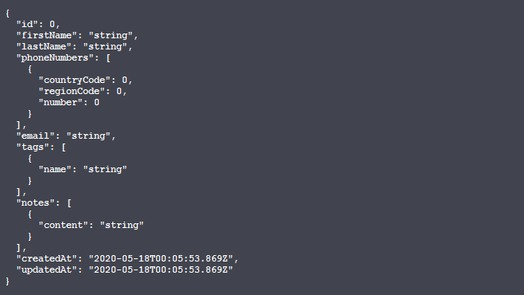

# :tada: SpringBoot-Agenda-Backend
Just a small backend project for a Contact Book.

# Model


# TODO
- [ ] Implement i18n
- [ ] Add Tests
- [ ] Improve models (maybe add more fields)
- [x] Implement Custom Error handling
- [x] Implement SpringDoc OpenAPI

```
k-ty-byeee
```
